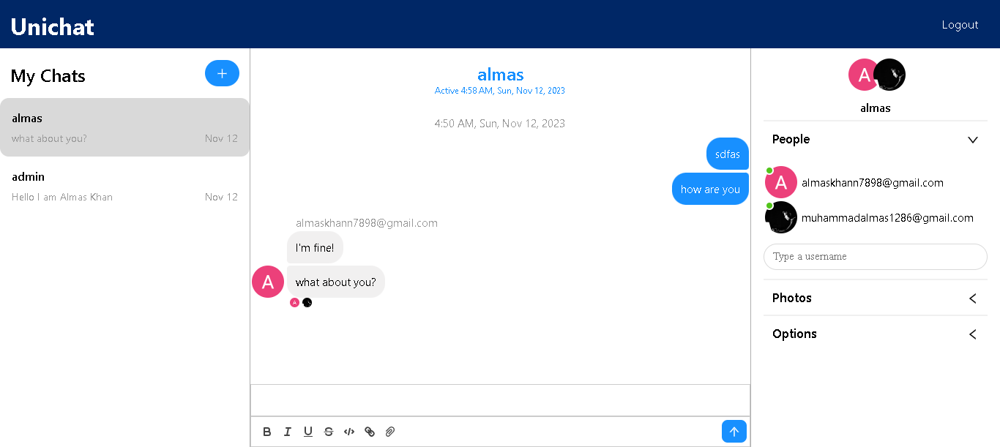

# UniChat 💬

UniChat is a delightful real-time chat application crafted with ❤️ and cutting-edge technologies.

## Features ✨

- **Seamless Conversations**: Engage in real-time conversations with friends and colleagues.
- **Secure Authentication**: Built on the robust Firebase authentication system.
- **Dynamic User Profiles**: Enjoy dynamic updates to your user profile, including avatars.
- **Intuitive Chat Interface**: A user-friendly interface for an enjoyable chatting experience.

## Technologies Used 🚀

- **React (⚛)**
- **Firebase (🔥)**
- **Chat Engine (💬)**

## Getting Started 🌟

1. Clone the repository.
2. Install dependencies: `npm install`
3. Set up your environment variables.
4. Run the app: `npm start`

## How to Contribute 🤝

Contributions are welcome! Feel free to open issues or submit pull requests.

## Acknowledgments 🙌

- Hat tip to anyone whose code was used.
- Special thanks to the open-source community.

Happy Chatting! 🚀

## 🔗 Social Links:

|  |  |
| --- | --- |
